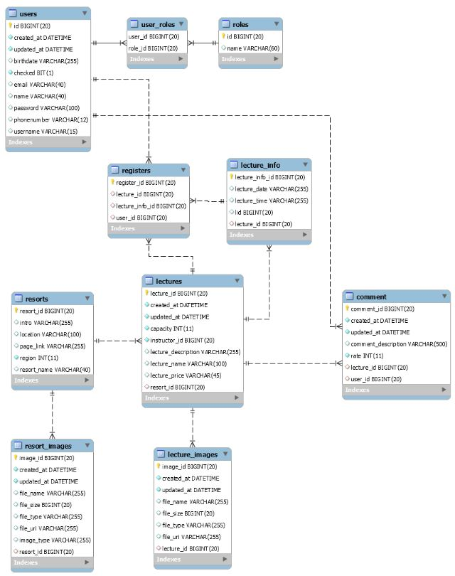
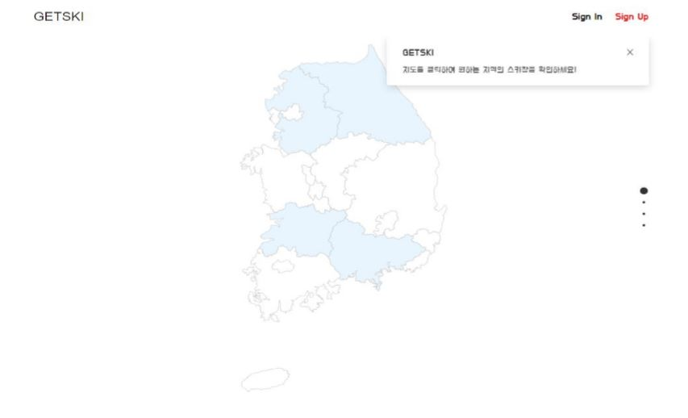
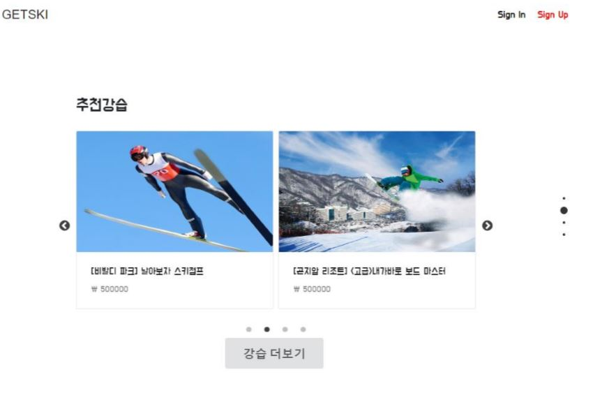
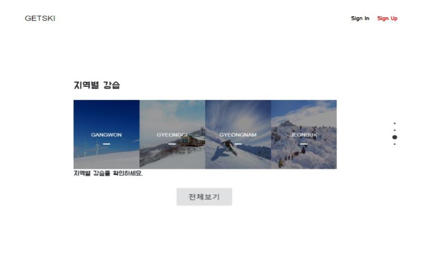
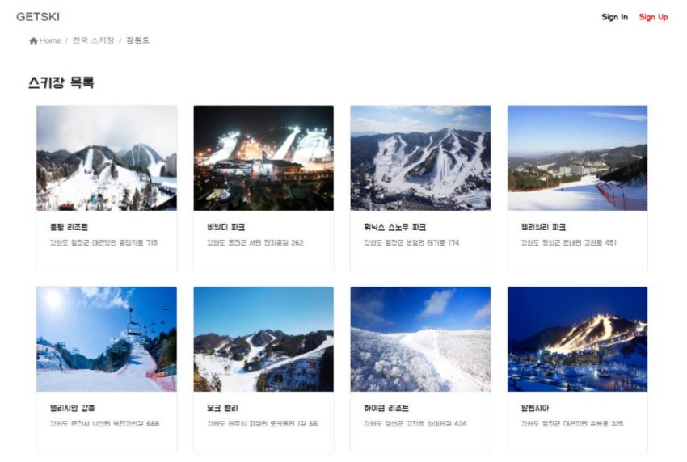
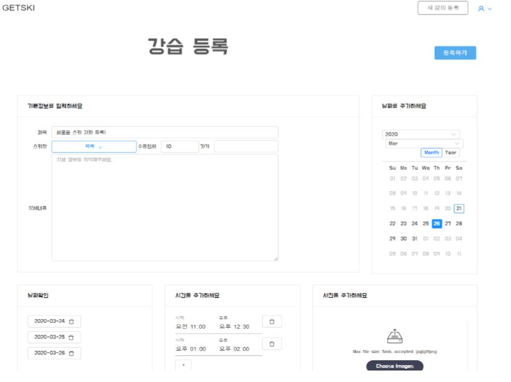
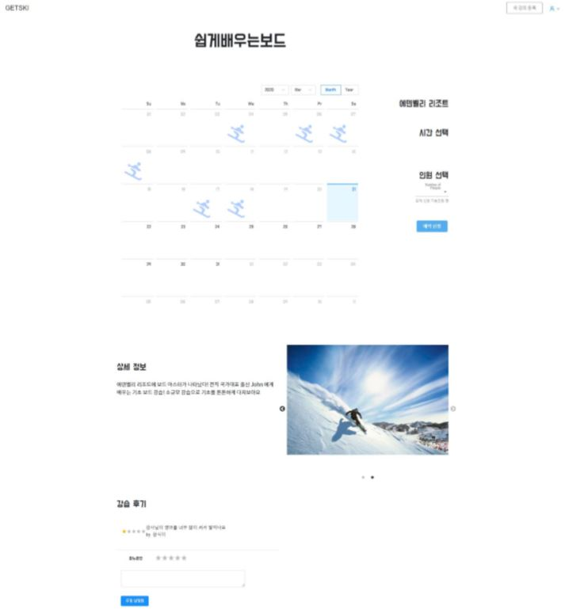

#### ㅡ GETSKI (강습 연계 플랫폼)


## Table of Contents

- [Teams](#Teams)
- [Introduction](#introduction)
- [Prerequisite](#prerequisite)
- [Development](#development)
  - [Testing](#testing)
  - [Commit](#commit)
  - [Role](#role)
- [Design](#design)
- [License](#license)
- [About](#about)


## Teams

- 김민호
- 김은영
- 김지희 
- 박성호 
- 신광식 

## Introduction
관리자의 경우 전국에 존재하는 스키장의 정보와 사진들을 종합하여 등록한다.

강사의 경우 자신이 원하는 스키장의 강습을 등록하고 다양한 정보와 사진들을 추가하여 강습자를 모집한다.

강습자의 경우 강사가 등록해놓은 강습중 선택하여 후기와 별점을 보고 구매를 결정한다.

```
getski
|-- backend
	`--gradle
	`--main/java/com/getski
				`-- config
				`-- controller
				`-- exception
				`-- model
				`-- payload
				`-- repository
				..
|-- frontend
	`-- src
		`-- App.js
		`-- index.js
		`-- component
		`-- constants
		`-- lecture
		`-- resort
		`-- container
		`-- user
		..
	`-- pakage.json
	..
|-- images
 ``
```
## Prerequisite

Must run in the spring framework.

- [spring_framework](https://spring.io/projects/spring-framework): Develop using spring boot.

## Development

### Commit

We are following [Angular's commitizen rules](https://github.com/angular/angular.js/blob/master/DEVELOPERS.md#-git-commit-guidelines) for formatting git commit message. This allows you to read messages that are easy to understand when looking for project history. It also uses the git commit message to generate our [CHANGELOG](/CHANGELOG.md) file.
```bash
$ npm install -g git-cz
$ git add .
$ git git-cz
$ git push
```

### Role
- Back-End

  - Spring boot 에 REST API 처리

  - JPA

  - Spring security

  - VO

  - repository

  - service

  - controller

    - User CRUD API

    - Resort CRUD API
    - Lecture CRUD  API 구현

- Front-End
  - React.js
    - 회원가입, 로그인 page
    - 회원정보 조회 및 수정 page
    - Resort 등록, 조회 page 구현

## DB Design




## Result

- 메인페이지(Full Page)



- 강습추천



- 지역별 강습 보기



- 지역별 강습


- 지역별 스키장



- 새 강습 등록



- 강습 상세정보



## license
MIT License

## About
Authored and maintained by **MinhoKim**
